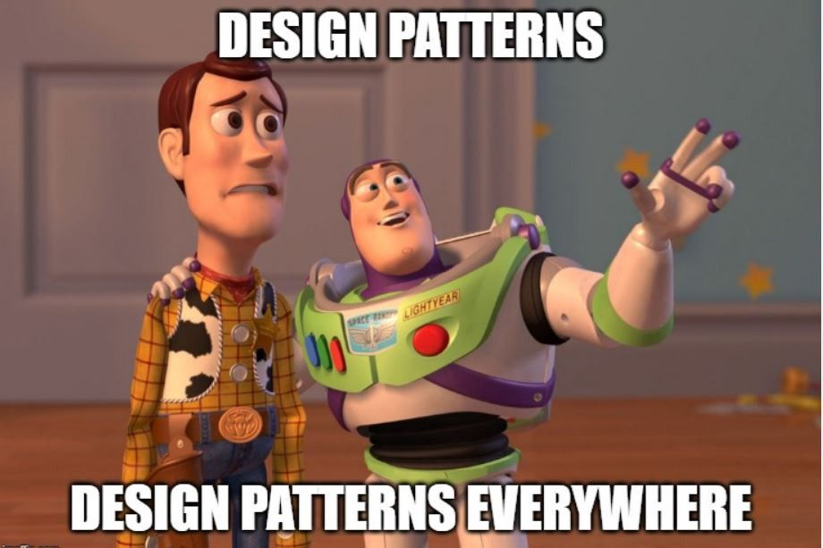
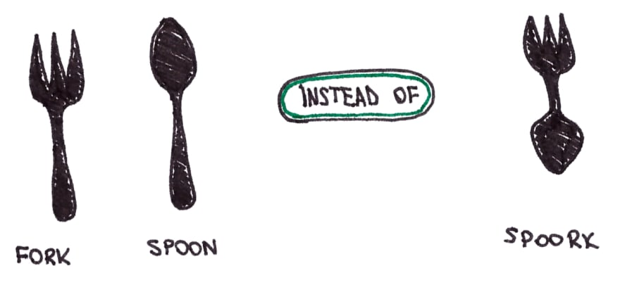
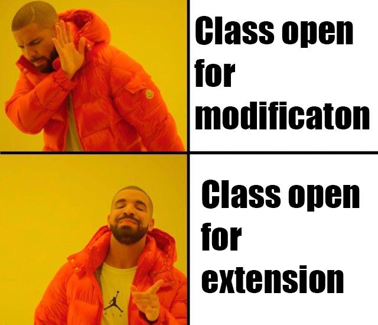
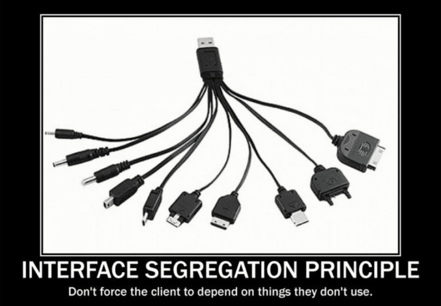

## 甚麼是Design pattern?



- 設計模式（Design Patterns）是在軟體工程中常見的解決特定問題的模板。它們是已經被證明有效的解決方案，可以用於解決在設計應用程式或系統時可能遇到的特定設計問題。設計模式可以提高開發人員的效率，因為它們提供了一種可重用和可理解的方式來解決常見問題。
- 設計模式的七大原則
  - 單一職責原則（Single Responsibility Principle, SRP）：一個類或方法應該只負責一項職責。
    
  - 開放封閉原則（Open-Closed Principle, OCP）：軟體實體（類、模組、函數等等）應該對擴展開放，對修改封閉。就是說如果你有需要改變一個類別的行為，你應該藉由擴展(程式碼)，而非修改(程式碼)。
    - 範例1: 如果我想要用這個方法來計算圓形的面積，我必須要修改AreaCalculator的程式碼，這樣就違反了開放封閉原則。
        ```java
        class Rectangle {
            public double width;
            public double height;
        }

        class AreaCalculator {
            public double calculateRectangleArea(Rectangle rectangle) {
                return rectangle.width * rectangle.height;
            }
        }
        ```
    - 範例2: 為了能夠符合開放封閉原則，我們可以建立一個Shape介面，並且讓Rectangle與Circle分別實作這個介面，這樣就可以讓AreaCalculator不需要直接依賴於Rectangle與Circle。
        ```java
        interface Shape {
            double calculateArea();
        }

        class Rectangle implements Shape {
            public double width;
            public double height;

            public double calculateArea() {
                return width * height;
            }
        }

        class Circle implements Shape {
            public double radius;

            public double calculateArea() {
                return Math.PI * Math.pow(radius, 2);
            }
        }

        class AreaCalculator {
            public double calculateShapeArea(Shape shape) {
                return shape.calculateArea();
            }
        }
        ```
    
  - 里氏替換原則（Liskov Substitution Principle, LSP）：子類別必須能夠替換他們的父類別。也就是說，軟體中的對象應該是可以在不改變程式正確性的前提下被他們的子類別所替換的。
    
    - 範例1: 如果使用以下的程式碼，我的鳥類有麻雀與企鵝，麻雀飛行不會有錯誤，但是企鵝飛行會有錯誤，因此不符合里氏替換原則。
        ```java
        class Bird {
            void fly() {
                System.out.println("Bird is flying");
            }
        }

        class Penguin extends Bird {
            @Override
            void fly() {
                throw new UnsupportedOperationException("Penguins can't fly");
            }
        }
        ```
    - 範例2: 為了能夠符合里氏替換原則，我們可以將鳥類分為飛行鳥類與不飛行鳥類，並且將企鵝歸類為不飛行鳥類。
        ```java
        class Bird {
        }

        class FlyingBird extends Bird {
            void fly() {
                System.out.println("Bird is flying");
            }
        }

        class Penguin extends Bird {
        }
        ```
  - 依賴倒置原則（Dependency Inversion Principle, DIP）：高層模組不應該依賴於低層模組，兩者都應該依賴於抽象。抽象不應該依賴於細節，細節應該依賴於抽象。
    - 範例1: ElectricPowerSwitch直接依賴於LightBulb，會導致當我們想要使用電燈泡以外的裝置時，必須要修改ElectricPowerSwitch的程式碼，這樣就違反了依賴倒置原則。
        ```java
        // 低層模組
        class LightBulb {}

        // 高層模組
        class ElectricPowerSwitch {
            private LightBulb lightBulb;

            public ElectricPowerSwitch(LightBulb lightBulb) {
                this.lightBulb = lightBulb;
            }

            public void press() {
                // Switch on/off the light bulb
            }
        }
        ```
    - 範例2: 為了遵守依賴倒置原則，我們建立一個interface，並且讓LightBulb與ElectricPowerSwitch分別實作這個interface，這樣就可以讓ElectricPowerSwitch不需要直接依賴於LightBulb。
        ```java
        interface Switchable {
            void turnOn();
            void turnOff();
        }

        class LightBulb implements Switchable {
            public void turnOn() {
                System.out.println("LightBulb: Bulb turned on...");
            }

            public void turnOff() {
                System.out.println("LightBulb: Bulb turned off...");
            }
        }

        class ElectricPowerSwitch {
            private Switchable device;

            public ElectricPowerSwitch(Switchable device) {
                this.device = device;
            }

            public void press() {
                // Switch on/off the device
            }
        }
        ```
        - My experience
          - 實際上，過去的專案中，經常有出現很多類別並沒有實作任何interface，因為很多類別並沒有很明確的擴張需求，那我們還需要硬多做一個interface嗎？
  - 介面隔離原則（Interface Segregation Principle, ISP）：子類別不應該被強迫實作他們不會使用的方法。一個類別應該僅有它需要使用的方法，也就是說，介面應該是子類別所需要的，而不是一個臃腫不堪的介面。
    
    - 範例1: 如果我的worker有一個人類一個機器人，而機器人並不需要eat方法，但是因為worker有eat方法，因此機器人也必須實作eat方法，這樣就違反了介面隔離原則。
        ```java
        interface Worker {
            void work();
            void eat();
        }

        class Human implements Worker {
            @Override
            public void work() {
                System.out.println("Human is working");
            }

            @Override
            public void eat() {
                System.out.println("Human is eating");
            }
        }

        class Robot implements Worker {
            @Override
            public void work() {
                System.out.println("Robot is working");
            }

            @Override
            public void eat() {
                // Do nothing
            }
        }
        ```
    - 範例2: 為了能夠符合介面隔離原則，我們可以將Worker介面拆分為Workable與Feedable兩個介面，並且將Human與Robot分別實作Workable與Feedable兩個介面。
        ```java
        interface Workable {
            void work();
        }

        interface Feedable {
            void eat();
        }

        class Human implements Workable, Feedable {
            @Override
            public void work() {
                System.out.println("Human is working");
            }

            @Override
            public void eat() {
                System.out.println("Human is eating");
            }
        }

        class Robot implements Workable {
            @Override
            public void work() {
                System.out.println("Robot is working");
            }
        }
        ```
  - 合成/聚合復用原則（Composition/Aggregation Reuse Principle, CARP）：儘量使用物件的組合/聚合，而不是繼承來達到軟體復用的目的。
    - 範例1: Car類繼承了Engine類來使用其start方法。這種方式的問題在於，如果Engine類的實現改變，可能會影響到Car類。此外，這種設計也違反了現實世界的模型，因為汽車並不是引擎，汽車有引擎。
    ```java
    class Engine {
        void start() {}
    }

    class Car extends Engine {
        void startCar() {
            start();
        }
    }
    ```
    - 範例2: 為了能夠符合合成/聚合復用原則，我們可以將Engine類的實例作為Car類的成員變數，並且在Car類中調用Engine類的start方法。
    ```java
    class Engine {
        void start() {}
    }

    class Car {
        private Engine engine;

        Car(Engine engine) {
            this.engine = engine;
        }

        void startCar() {
            engine.start();
        }
    }
    ```
  - 最少知識原則（Principle of Least Knowledge, LoD）：一個對象應該盡可能少地了解其他對象。又稱為迪米特原則(Demeter Principle)。核心概念就是降低類別與類別的耦合。
    - 直接朋友: 以參數形式出現在類別中的對象，以成員變數形式出現在類別中的對象，以方法返回值形式出現在類別中的對象。
    - 陌生朋友: 以局部變數形式出現在類別中的對象。
    - 而最少知識原則就試陌生朋友不應該出現在類別中。而盡量變成直接朋友。
    - 範例1: 如果我想要獲取學生的宿舍地址，讓學生類去獲取宿舍地址，但是這樣就違反了最少知識原則，因為學生類並不需要知道宿舍類的存在。
        ```java
        // 學生類
        class Student {
            private String name;

            public Student(String name) {
                this.name = name;
            }

            // 學生直接訪問學生宿舍的信息
            public void displayDormitoryInfo() {
                Dormitory dormitory = new Dormitory();
                System.out.println(name + " 宿舍地址: " + dormitory.getAddress());
            }
        }

        // 宿舍類
        class Dormitory {
            private String address;

            public Dormitory() {
                this.address = "123 Main St";
            }

            public String getAddress() {
                return address;
        }
        
        ```
    - 範例2: 為了能夠符合最少知識原則，我們可以讓學生類透過宿舍類獲取宿舍地址，這樣就不需要讓學生類知道宿舍類的存在。
        ```java
        // 學生類
        class Student {
            private String name;
            private Dormitory dormitory;

            public Student(String name, Dormitory dormitory) {
                this.name = name;
                this.dormitory = dormitory;
            }

            // 學生通過宿舍對象獲取宿舍信息
            public void displayDormitoryInfo() {
                System.out.println(name + " 宿舍地址: " + dormitory.getAddress());
            }
        }

        // 宿舍類
        class Dormitory {
            private String address;

            public Dormitory(String address) {
                this.address = address;
            }

            public String getAddress() {
                return address;
            }
        }
        ```
- 設計模式通常可以分為三種類型：
    - 創建型模式（Creational Patterns）：這些模式與對象的創建有關，並且試圖在不指定具體類型的情況下創建對象。
      - 單例模式（Singleton）
      - 工廠方法模式（Factory Method）
      - 抽象工廠模式（Abstract Factory）
      - 建造者模式（Builder）
      - 原型模式（Prototype）
    - 結構型模式（Structural Patterns）：這些模式涉及到類和對象的組合，並且通常用於確保不同的系統部分正確地一起工作。
      - 適配器模式（Adapter）
      - 橋接模式（Bridge）
      - 組合模式（Composite）
      - 裝飾者模式（Decorator）
      - 外觀模式（Facade）
      - 享元模式（Flyweight）
      - 代理模式（Proxy）
    - 行為型模式（Behavioral Patterns）：這些模式專注於對象之間的通信，並且通常用於實現更好的通信和更緊密的關係。
      - 鏈接責任模式（Chain of Responsibility）
      - 命令模式（Command）
      - 解釋器模式（Interpreter）
      - 迭代器模式（Iterator）
      - 中介者模式（Mediator）
      - 備忘錄模式（Memento）
      - 觀察者模式（Observer）
      - 狀態模式（State）
      - 策略模式（Strategy）
      - 模板方法模式（Template Method）
      - 訪問者模式（Visitor）
- 每種設計模式都有其特定的使用場景，並且在適當的情況下使用可以大大提高軟體設計的效率和質量。

### 創建型模式（Creational Patterns）

- 創建型模式涉及到對象的實例化，這類模式都提供一個方法，將客戶從所需要實例化的對象中解耦。

#### 單例模式（Singleton）

- 單例模式是一種創建型模式，它提供了一種創建物件的最佳方式。這種模式涉及到單一個類別，該類別負責創建自己的實例，同時確保只有單個實例被創建。這個類提供了一個方法，可以直接獲取到它的唯一實例。該類別創建的實例，稱為單例對象
- 精神
  - 確保一個類只有一個實例：透過隱藏構造函數並提供一個全局訪問點來實現。
  - 提供一個全局訪問點：透過一個公共的靜態方法來實現，該方法返回該類的唯一實例。
  - 控制對共享資源的存取：透過將這些資源封裝在單例類中來實現。
- 建構方式
    - 餓漢式(靜態常量)
    - 餓漢式(靜態程式碼區塊)
    - 懶漢式(線程不安全)
    - 懶漢式(線程安全，同步方法)
    - 懶漢式(線程安全，同步程式碼區塊)
    - 雙重檢查
    - 靜態內部類
    - 枚舉
- 使用時機
  - 當類只需要一個實例，並且該實例需要提供一個全局訪問點時。例如，如果你需要一個全局的設定對象來存儲應用程式的設定。
  - 當你需要一個共享資源，例如，每個應用程式只能有一個窗口管理器或文件系統。
  - 當你需要一個對象來協調系統中的其他對象。例如，你可能有一個對象來管理所有的數據庫連接。
- 優點
  - 單一實例：確保一個類只有一個實例，並提供一個全局訪問點。
  - 共享資源：單例對象可以被多個其他對象共享，用於存取共享資源。
  - 減少系統開銷：當一個對象的產生需要比較大的系統資源時，有了單例模式，可以避免重複實例化。
- 缺點
  - 全局變量：單例模式實質上就是全局變量，可能會被誤用，導致數據被無意間修改。
  - 測試困難：單例模式會導致代碼之間的緊密耦合，使得單元測試變得困難。
- Example in java
  - 餓漢式(靜態常量): 在類別載入時就完成了實例化，避免了線程同步問題，但是如果從未使用過這個實例，則會造成內存的浪費。
  ```java
    public class Singleton {
        private static final Singleton instance = new Singleton();

        private Singleton() {}

        public static Singleton getInstance() {
            return instance;
        }
    }

    public void main(String[] args) {
        Singleton instance1 = Singleton.getInstance();
        Singleton instance2 = Singleton.getInstance();
        System.out.println(instance1 == instance2); // true
    }
  ```
  - 餓漢式(靜態程式碼區塊): 在類別載入時就完成了實例化，避免了線程同步問題，但是如果從未使用過這個實例，則會造成內存的浪費。
  ```java
    public class Singleton {
        private static Singleton instance;

        static {
            instance = new Singleton();
        }

        private Singleton() {}

        public static Singleton getInstance() {
            return instance;
        }
    }

    public void main(String[] args) {
        Singleton instance1 = Singleton.getInstance();
        Singleton instance2 = Singleton.getInstance();
        System.out.println(instance1 == instance2); // true
    }
  ```
  - 懶漢式(線程不安全): 在第一次調用getInstance方法時才進行實例化，避免了餓漢式的內存浪費問題，但是如果多個線程同時調用getInstance方法，則可能會產生多個實例。
  ```java
  public class Singleton {
      private static Singleton instance;

      private Singleton() {}

      public static Singleton getInstance() {
          if (instance == null) {
              instance = new Singleton();
          }
          return instance;
      }
  }

    public void main(String[] args) {
        Singleton instance1 = Singleton.getInstance();
        Singleton instance2 = Singleton.getInstance();
        System.out.println(instance1 == instance2); // true
    }
  ```
  - 懶漢式(線程安全，同步方法): 在第一次調用getInstance方法時才進行實例化，避免了餓漢式的內存浪費問題，並且使用synchronized關鍵字來保證線程安全，但是每次調用getInstance方法的thread都要排隊，造成效能低落。
  ```java
    public class Singleton {
        private static Singleton instance;
    
        private Singleton() {}
    
        public static synchronized Singleton getInstance() {
            if (instance == null) {
                instance = new Singleton();
            }
            return instance;
        }
    }

    public void main(String[] args) {
        Singleton instance1 = Singleton.getInstance();
        Singleton instance2 = Singleton.getInstance();
        System.out.println(instance1 == instance2); // true
    }
    ```
  - 懶漢式(線程不安全，同步程式碼區塊): 在第一次調用getInstance方法時才進行實例化，避免了餓漢式的內存浪費問題，並且使用synchronized關鍵字來保證線程安全，但基本上，只要通過if判斷，就算線程安全了，仍然會new出多個實例，因此這種方式並不安全。
  ```java
    public class Singleton {
        private static Singleton instance;

        private Singleton() {}

        public static Singleton getInstance() {
            if (instance == null) {
                synchronized (Singleton.class) {
                    instance = new Singleton();
                }
            }
            return instance;
        }
    }
  ```
  - 雙重檢查(推薦): 在第一次調用getInstance方法時才進行實例化，避免了餓漢式的內存浪費問題，並且使用synchronized關鍵字來保證線程安全，同時也保持了效能，但是需要注意的是，由於指令重排的問題，可能會導致獲取到未初始化完成的實例，因此需要使用volatile關鍵字來保證可見性。
  ```java
    public class Singleton {
        private static volatile Singleton instance;
    
        private Singleton() {}
    
        public static Singleton getInstance() {
            if (instance == null) {
                synchronized (Singleton.class) {
                    if (instance == null) {
                        instance = new Singleton();
                    }
                }
            }
            return instance;
        }
    }
  ```
  - 靜態內部類(推薦使用): 在第一次調用getInstance方法時才進行實例化，避免了餓漢式的內存浪費問題，並且使用靜態內部類來實現延遲實例化，同時藉由JVM的類加載機制來保證線程安全。因為靜態內部類只會被加載一次，因此在加載時，會保證線程安全。
  ```java
    public class Singleton {
        private Singleton() {}
    
        private static class SingletonInstance {
            private static final Singleton INSTANCE = new Singleton();
        }
    
        public static Singleton getInstance() {
            return SingletonInstance.INSTANCE;
        }
    }

    public void main(String[] args) {
        Singleton instance1 = Singleton.getInstance();
        Singleton instance2 = Singleton.getInstance();
        System.out.println(instance1 == instance2); // true
    }
  ```
  - 枚舉(推薦): 在第一次調用getInstance方法時才進行實例化，避免了餓漢式的內存浪費問題，並且使用枚舉來實現延遲實例化，同時保證了線程安全。
  ```java
    public enum Singleton {
        INSTANCE;
    }

    public void main(String[] args) {
        Singleton instance1 = Singleton.INSTANCE;
        Singleton instance2 = Singleton.INSTANCE;
        System.out.println(instance1 == instance2); // true
    }
  ```
  

#### 簡單工廠模式（Simple Factory）

- 簡單工廠模式是一種創建型模式，它提供了一種將實例化的邏輯封裝在一個方法中的方式。這個方法可以根據不同的參數創建不同的對象。
- 精神
  - 封裝創建對象的邏輯：透過一個工廠類和一個工廠方法來實現。
  - 提供一個全局訪問點：透過一個公共的方法來實現，該方法根據傳入的參數返回不同的對象。
- 使用時機
  - 當創建對象的邏輯比較複雜，需要將其封裝在一個方法中時。
  - 當需要根據不同的參數創建不同的對象時。
- 優點
  - 簡化了對象的創建：將創建對象的邏輯封裝在一個方法中，使得客戶端不需要知道具體的創建邏輯。
  - 提供了一個全局訪問點：客戶端只需要調用工廠方法就可以獲得所需的對象。
- 缺點
  - 違反了開閉原則：每當需要添加一種新的產品，都需要修改工廠類的代碼。
- Example in java
  - 不符合簡單工廠原則
    ```java
    public interface Product {
    void show();
    }

    public class ConcreteProduct1 implements Product {
        @Override
        public void show() {
            System.out.println("ConcreteProduct1 show");
        }
    }

    public class ConcreteProduct2 implements Product {
        @Override
        public void show() {
            System.out.println("ConcreteProduct2 show");
        }
    }

    public class Client {
        public static void main(String[] args) {
            Product product1 = new ConcreteProduct1();
            product1.show();
            Product product2 = new ConcreteProduct2();
            product2.show();
        }
    }
    ```
    - 符合簡單工廠原則
    ```java
    // 建立一個介面
    public interface Product {
        void show();
    }

    // 實現介面的具體產品類
    public class ConcreteProduct1 implements Product {
        @Override
        public void show() {
            System.out.println("ConcreteProduct1 show");
        }
    }

    public class ConcreteProduct2 implements Product {
        @Override
        public void show() {
            System.out.println("ConcreteProduct2 show");
        }
    }

    // 建立工廠類
    public class SimpleFactory {
        public Product makeProduct(int kind) {
            switch (kind) {
                case 1:
                    return new ConcreteProduct1();
                case 2:
                    return new ConcreteProduct2();
                default:
                    return null;
            }
        }
    }

    // 客戶端代碼
    public class Client {
        public static void main(String[] args) {
            SimpleFactory factory = new SimpleFactory();
            Product product1 = factory.makeProduct(1);
            if (product1 != null) {
                product1.show();
            }
            Product product2 = factory.makeProduct(2);
            if (product2 != null) {
                product2.show();
            }
        }
    }
    ```

#### 工廠方法模式（Factory Method）

- 工廠方法模式是一種創建型模式，它提供了一種將實例化的邏輯封裝在一個方法中的方式。與簡單工廠模式不同的是，工廠方法模式使用繼承來改變實例化的邏輯，它解決了簡單工廠模式中工廠類職責過重的問題，也遵循了開閉原則。
- 精神
  - 封裝創建對象的邏輯：透過一個工廠類和一個工廠方法來實現。
  - 提供一個全局訪問點：透過一個公共的方法來實現，該方法由子類實現，以創建具體的對象。
- 使用時機
  - 當一個類不知道它所需要的對象的類時。
  - 當一個類希望由它的子類來指定它所創建的對象時。
  - 當一個類希望將創建對象的責任委託給一個或多個幫助子類，並且你希望將哪個子類是幫助者這一信息局部化時。
- 優點
  - 提供了一種將實例化的邏輯封裝在子類中的方式，這使得客戶端代碼可以與具體類的實例化邏輯解耦。
  - 提供了一種添加新產品的方式，只需要定義一個實現了工廠方法的新類即可。
- 缺點
  - 可能會導致代碼的複雜性增加，因為每增加一種產品，就需要增加一個具體的創建者類。
- Example in java    
  - 符合工廠方法模式
    ```java
    // 建立一個介面
    public interface Product {
        void show();
    }

    // 實現介面的具體產品類
    public class ConcreteProduct1 implements Product {
        @Override
        public void show() {
            System.out.println("ConcreteProduct1 show");
        }
    }

    public class ConcreteProduct2 implements Product {
        @Override
        public void show() {
            System.out.println("ConcreteProduct2 show");
        }
    }

    // 建立抽象工廠類
    public abstract class Factory {
        public abstract Product createProduct();
    }

    // 具體工廠類
    public class ConcreteFactory1 extends Factory {
        @Override
        public Product createProduct() {
            return new ConcreteProduct1();
        }
    }

    public class ConcreteFactory2 extends Factory {
        @Override
        public Product createProduct() {
            return new ConcreteProduct2();
        }
    }

    // 客戶端代碼
    public class Client {
        public static void main(String[] args) {
            Factory factory1 = new ConcreteFactory1();
            Product product1 = factory1.createProduct();
            product1.show();

            Factory factory2 = new ConcreteFactory2();
            Product product2 = factory2.createProduct();
            product2.show();
        }
    }    
    ```
#### 抽象工廠模式（Abstract Factory）

- 抽象工廠模式是一種創建型模式，它提供了一種方式，可以將一組具有同一主題的單獨的工廠封裝起來。在抽象工廠模式中，客戶端代碼通過一個共同的介面來創建實際的對象，但是實際創建的對象在程序運行時才會被確定。其實抽象工廠就是簡單工廠+工廠方法。
- 精神
  - 封裝創建對象的邏輯：透過一個抽象工廠類和一組工廠方法來實現。
  - 提供一個全局訪問點：透過一個公共的方法來實現，該方法由具體的工廠類實現，以創建具體的對象。
- 使用時機
  - 當一個系統需要獨立於其產品的創建、組合和表示時。
  - 當一個系統需要配置多個產品系列中的一個產品。
  - 當你想要提供一個產品庫，並且只想顯示它們的接口而不是實現時。
- 優點
  - 提供了一種將實例化的邏輯封裝在具體的工廠類中的方式，這使得客戶端代碼可以與具體類的實例化邏輯解耦。
  - 提供了一種添加新產品的方式，只需要定義一個實現了工廠方法的新類即可。
- 缺點
  - 可能會導致代碼的複雜性增加，因為每增加一種產品，就需要增加一個具體的創建者類。
- Example in java    
    ```java  
    // 建立一個介面
    public interface Product {
        void show();
    }

    // 實現介面的具體產品類
    public class ConcreteProduct1 implements Product {
        @Override
        public void show() {
            System.out.println("ConcreteProduct1 show");
        }
    }

    public class ConcreteProduct2 implements Product {
        @Override
        public void show() {
            System.out.println("ConcreteProduct2 show");
        }
    }

    // 建立抽象工廠類
    public abstract class AbstractFactory {
        public abstract Product createProduct1();
        public abstract Product createProduct2();
    }

    // 具體工廠類
    public class ConcreteFactory1 extends AbstractFactory {
        @Override
        public Product createProduct1() {
            return new ConcreteProduct1();
        }

        @Override
        public Product createProduct2() {
            return new ConcreteProduct2();
        }
    }

    // 客戶端代碼
    public class Client {
        public static void main(String[] args) {
            AbstractFactory factory = new ConcreteFactory1();
            Product product1 = factory.createProduct1();
            product1.show();
            Product product2 = factory.createProduct2();
            product2.show();
        }
    }
    ```
- My experience
  - 經過的專案其實很少用到抽象類別，不知是們設計的不好，還是其實沒那麼需要

##### Java中有使用到工廠模式的例子嗎？

- java.util.Calendar#getInstance()，細節我就不寫了。

#### 原型模式（Prototype）

- 原型模式是一種創建型模式，它使用複製原型的方式來創建新的對象。在原型模式中，我們可以利用已有的對象創建新的對象，而不需要知道具體的創建細節。
- 精神
  - 封裝創建對象的邏輯：透過複製一個已有的對象來創建新的對象，而不需要知道具體的創建細節。這種方式避免了創建新對象時的初始化開銷和性能開銷。
  - 提供一個全局訪問點：透過一個公共的方法來實現，該方法可以複製一個已有的對象並返回。這種方式使得客戶端可以直接獲得一個新的對象，而不需要關心具體的創建過程。
- 使用時機
  - 當一個系統需要獨立於其產品的創建、組合和表示時。
  - 當一個對象的狀態變化達到某一個閾值時，可以將其當作原型進行複製。
- 優點
  - 效能優化：原型模式可以避免創建一個對象需要的昂貴的創建過程（如：資源的初始化、資料庫的讀取等）。
  - 動態添加和删除：原型模式可以在運行時動態地添加或删除產品。
  - 增加或減少產品類：原型模式可以增加或減少產品類。
  - 配置方便：可以在運行時由客戶端動態地指定“克隆體”。
- 缺點
  - 複製複雜對象：對於複雜對象的複製可能會相當困難，特別是當對象之間存在著復雜的引用關係時。
  - 深拷貝與淺拷貝問題：深拷貝與淺拷貝問題是開發人員需要注意的問題，不注意這個問題可能會導致程式行為上的錯誤。
  - 每增加一種產品，就需要增加一個具體的原型類：這會導致代碼的複雜性增加。
- Example in java    
    ```java  
    abstract class Prototype implements Cloneable {
        abstract Prototype clone() throws CloneNotSupportedException;
    }

    class ConcretePrototype extends Prototype {
        private String field;

        ConcretePrototype(String field) {
            this.field = field;
        }

        @Override
        Prototype clone() throws CloneNotSupportedException {
            return (ConcretePrototype) super.clone();
        }

        @Override
        public String toString() {
            return field;
        }
    }

    public class Main {
        public static void main(String[] args) {
            try {
                ConcretePrototype original = new ConcretePrototype("original");
                System.out.println("Original instance: " + original);

                ConcretePrototype cloned = original.clone();
                System.out.println("Cloned instance: " + cloned);
            } catch (CloneNotSupportedException e) {
                e.printStackTrace();
            }
        }
    }
    ```

#### 建造者模式（Builder）

- 主要用於構建複雜對象。它將一個複雜對象的構建與其表示分離，使得同樣的構建過程可以創建不同的表示。建造者模式通常包含以下四個主要元素：
  - 產品（Product）：這是我們想要創建的複雜對象。
  - 建造者（Builder）：這是一個抽象接口，定義了創建產品對象的步驟。
  - 具體建造者（Concrete Builder）：這是實現Builder接口的類，實現了具體的建造過程。
  - 指導者（Director）：這是一個類，它擁有一個Builder對象，並通過這個Builder對象來構建產品。
- 使用時機
  - 當創建複雜對象的算法應該獨立於該對象的組件以及它們的裝配方式時。建造者模式可以提供更好的控制過程。
  - 當構建過程必須允許被構建的對象有不同的表示時。在建造者模式中，使用相同的構建過程可以創建不同的產品。
  - 當需要生成的對象具有複雜的內部結構，這些對象內部的組件之間存在著特定的生成順序。一個簡單的例子可能是創建一個簡單的HTML頁面，也可能是創建複雜的組合模式或者其他複雜的對象。
  - 當要在某個時間點創建一個對象，然後在稍後的時間點再編輯該對象。建造者模式可以提供一種方法來編輯已經創建的對象。
- 優點
  - 封裝性好：客戶端不需要知道具體的創建過程，只需要通過導演類來獲得需要的對象。
  - 擴展性好：如果需要創建的對象有新的類型，只需要擴展一個新的建造者就可以了。
  - 更好的控制細節：建造者模式可以更精細地控制產品的創建過程。例如，產品的創建可能需要多個步驟，這些步驟可能需要在特定的順序中執行。
- 缺點
  - 建造者模式的主要缺點是由於它包含了很多的細節，所以如果建造者內部變化的話，客戶端的代碼也需要進行修改。
  - 建造者模式會導致設計變得更加複雜，因為每個具體的建造者都需要實現相對應的方法來構建產品的各個部分。
- Example in java
  ```java
  public class Product {
        private String partA;
        private String partB;

        public void setPartA(String partA) {
            this.partA = partA;
        }

        public void setPartB(String partB) {
            this.partB = partB;
        }

        public void show() {
            // Show the product
        }
    }

    public abstract class Builder {
        protected Product product = new Product();

        public abstract void buildPartA();
        public abstract void buildPartB();

        public Product getResult() {
            return product;
        }
    }

    public class ConcreteBuilder extends Builder {
        public void buildPartA() {
            product.setPartA("Part A");
        }

        public void buildPartB() {
            product.setPartB("Part B");
        }
    }

    public class Director {
        public void construct(Builder builder) {
            builder.buildPartA();
            builder.buildPartB();
        }
    }

    public class Main {
        public static void main(String[] args) {
            // 指導者
            Director director = new Director();
            // 建造者 = 具體建造者
            Builder builder = new ConcreteBuilder();
            director.construct(builder);
            // 產品
            Product product = builder.getResult();
            product.show();
        }
    }
  ```

### 結構型模式（Structural Patterns）

- 結構型模式涉及到如何組合類和物件以形成更大的結構。結構型模式可以分為類結構型模式和物件結構型模式。類結構型模式使用繼承關係來組合類，物件結構型模式使用物件組合來組合物件。

#### 適配器模式（Adapter）

- 使兩個不兼容的接口能夠一起工作。這主要通過創建一個可以包裝不兼容對象的新接口來實現。
- 使用時機
  - 當你想使用一個已經存在的類，但是它的接口不符合你的需求。
  - 當你想創建一個可以與未來未知的類（即那些接口可能不一定兼容的類）協同工作的類。
  - 當你需要使用多個已經存在的子類，但是它們的接口不一致，並且你不能對它們進行修改。
- 優點
- 缺點
- Example in java
    ```java
    // 假設這是我們已有的、且不能修改的接口
    interface OldInterface {
        void oldMethod();
    }

    // 這是我們已有的實現，我們不能直接使用它
    class OldImplementation implements OldInterface {
        public void oldMethod() {
            System.out.println("Old method");
        }
    }

    // 這是我們期望的新接口
    interface NewInterface {
        void newMethod();
    }

    // 這是我們的適配器，它將新接口轉換為我們可以使用的形式
    class Adapter implements NewInterface {
        private OldInterface oldImplementation;

        public Adapter(OldInterface oldImplementation) {
            this.oldImplementation = oldImplementation;
        }

        public void newMethod() {
            oldImplementation.oldMethod();
        }
    }

    // 這是我們的客戶端代碼，它只知道新接口
    public class Client {
        public static void main(String[] args) {
            OldInterface oldImplementation = new OldImplementation();
            NewInterface adapter = new Adapter(oldImplementation);
            adapter.newMethod();  // 輸出：Old method
        }
    }    
    ```

#### 橋接模式（Bridge）


#### 組合模式（Composite）


#### 裝飾者模式（Decorator）


#### 外觀模式（Facade）


#### 享元模式（Flyweight）


#### 代理模式（Proxy）


class(類別)是用來定義object(物件)
一個object就是某個class的instance(實例)


